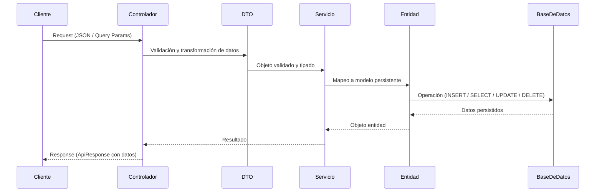

# Flujo de Datos API

```mermaid
sequenceDiagram
    participant Cliente
    participant Controlador
    participant DTO
    participant Servicio
    participant Entidad
    participant BaseDeDatos

    Cliente->>Controlador: Request (JSON / Query Params)
    Controlador->>DTO: Validación y transformación de datos
    DTO->>Servicio: Objeto validado y tipado
    Servicio->>Entidad: Mapeo a modelo persistente
    Entidad->>BaseDeDatos: Operación (INSERT / SELECT / UPDATE / DELETE)
    BaseDeDatos-->>Entidad: Datos persistidos
    Entidad-->>Servicio: Objeto entidad
    Servicio-->>Controlador: Resultado
    Controlador-->>Cliente: Response (ApiResponse con datos)
```